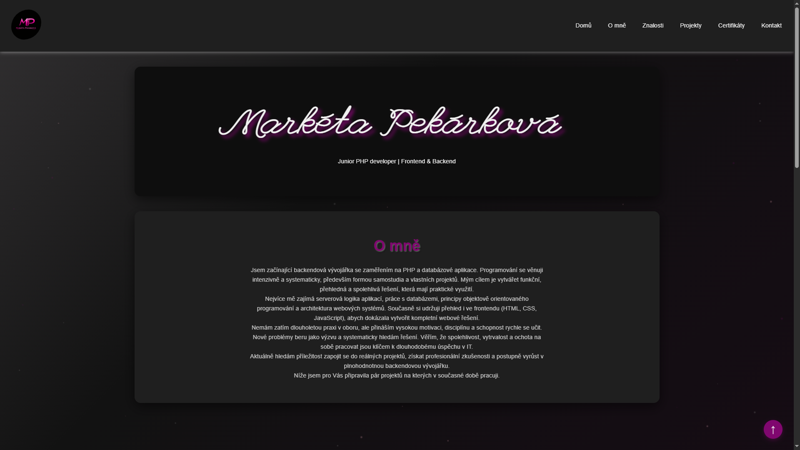

# 🌐 My Professional IT Portfolio

Vítejte v mém osobním portfoliu. Tato stránka slouží jako interaktivní rozcestník k mým projektům a prezentace mých dovedností v oblasti webového vývoje a HCI (Human-Computer Interaction).

## 🎨 Design & Koncept
* **Vizuální styl**: Moderní "Cyberpunk/Dark" UI s neonovými prvky, vytvořené s důrazem na čistotu a přehlednost.
* **Responzivita**: Web je plně optimalizován pro mobilní zařízení i desktopy (Mobile-First approach).
* **Interaktivita**: Využití CSS animací a hover efektů pro lepší uživatelský zážitek.

## 🛠️ Použité technologie
* **Frontend**: HTML5, CSS3 (Custom properties, Flexbox layout)
* **Ikony**: FontAwesome 6
* **Typografie**: Kombinace moderních bezpatkových písem pro maximální čitelnost.

## 📁 Obsah portfolia
Tento repozitář obsahuje kromě samotné vizitky také odkazy na mé klíčové projekty:
1. **ToDoList**: PHP/MySQL aplikace pro správu úkolů.
2. **MyEshop**: Komplexní e-commerce řešení ve frameworku Nette.
3. **PojisteniApp**: Ukázka objektově orientovaného programování v PHP.

.png)
